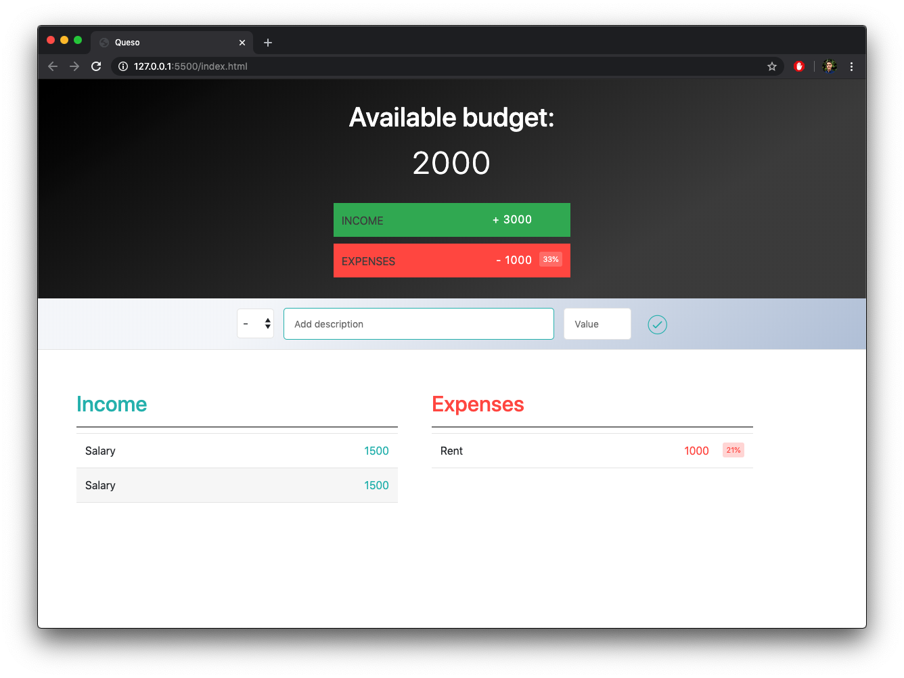

# Queso []
 A budgetting app I haven't finished.
 by mrivasperez live demo <https://mrivasperez.github.io/Queso/>

## About
Queso is a budgeting app to help you write out your daily, weekly, or monthly expenses and income. It is build using HTML, CSS, and Vanilla JS

## Screenshot

## Installation
You can use the app by visiting <https://mrivasperez.github.io/Queso/>. Alternately, to run this app locally, download the repository as a zip file. Create a new folder in your system then drag and drop the contents of the zip file to that new folder. Double click "index.html" to open the page.

## Guide
### About the user interface
When you first visit or open Queso, you will see the Available Budget, green total income display box, red total expense box, an input form row, and two columns titled Income and Expenses.
### How to add an income item
To add an income item, ensure the + button is selected in the drop down section the form, then type a description for the income item. Afterwards type the value for the income and press the enter key on your keyboard or click on the green checkbox on the form.
### How to add an expense item
To add an expense item, ensure the - button is selected in the drop down section the form, then type a description for the expense item. Afterwards type the value for the expense and press the enter key on your keyboard or click on the green checkbox on the form..
### How to delete items
To delete an expense or income item, hover over the item you wish to delete and press the green x that appears to the right of the item amount.
